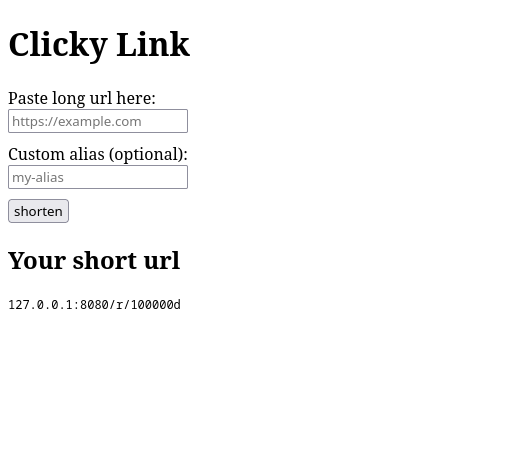

# Clicky Link

Clicky Link is a lightweight, high-performance URL shortener built with Spring Boot, PostgreSQL, and Redis. It converts long URLs into compact Base62 strings using database sequence offsets and offers custom link aliases.

## Features

- Generates short URLs based on auto-incremented PostgreSQL IDs shifted by a configurable offset.
- Allows users to specify custom short links instead of generated tokens.
- Built-in request throttling powered by Redis to prevent abuse.
- Automated schema management using Liquibase.
- Server-side rendered HTML interface using Thymeleaf.
- Pre-configured Dockerfile and Docker Compose setup for instant deployment.

## Tech Stack

- **Language**: Java 25
- **Framework**: Spring Boot 4.0.6 (Spring MVC, Validation, Thymeleaf, Spring Data Redis)
- **Database**: PostgreSQL 42.7 & Hibernate 7.4
- **Rate Limiting**: Redis
- **Migration**: Liquibase
- **Build Tool**: Maven

## How It Works

1. When a new URL is submitted without a custom alias, PostgreSQL generates a unique sequence ID.
2. The sequence ID is shifted by a predetermined default offset value to produce predictable, short, non-clashing identifiers.
3. The shifted value is converted into a base-62 string representation (e.g., `100000d`).
4. Visiting `/r/{shortUrl}` resolves the original URL and redirects the user.

## Project Structure

```text
ru.clicky.link/       
├── base62/ -- base62 encoder  
├── common/ -- general classes and others
├── core/  -- main feature
├── ping/ -- for docker checkhealth
├── ratelimiter/  -- ratelimiter: base secure from dos
└── ui/ -- simply ui for using app without postman
```
## Getting Started

### Prerequisites
- Java 25 JDK
- Docker & Docker Compose

### Environment Setup

Copy env.example to .env and fill in your configuration:
```text 
cp env.example .env
```

### Run with Docker Compose
```text
docker compose up -d --build
```
The application will be accessible at http://localhost:8080.

## License

This project is licensed under the MIT License - see the LICENSE file for details.
